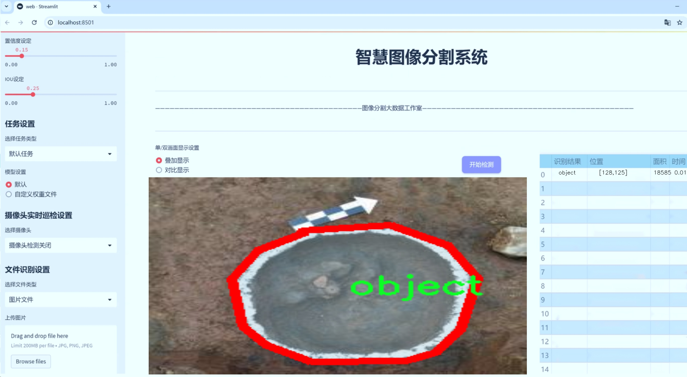
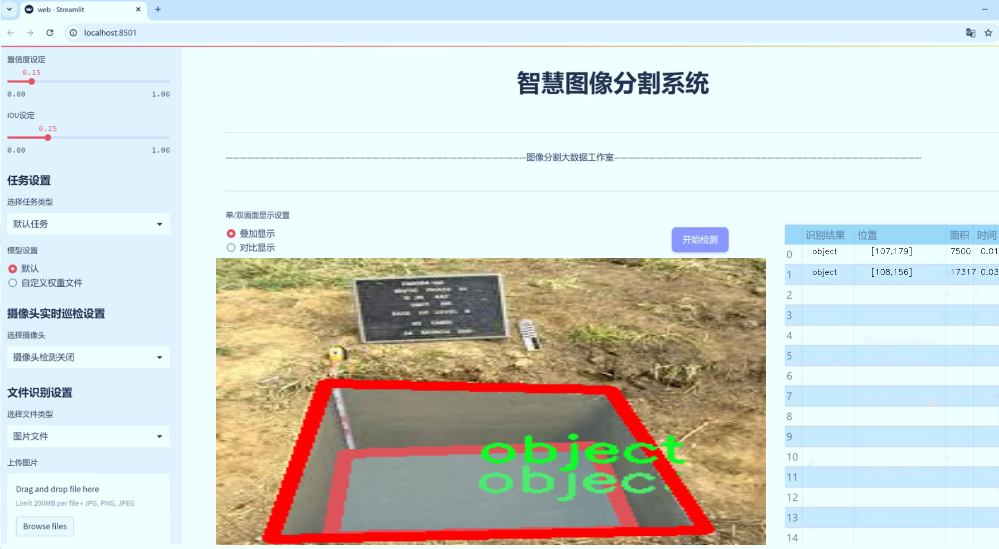
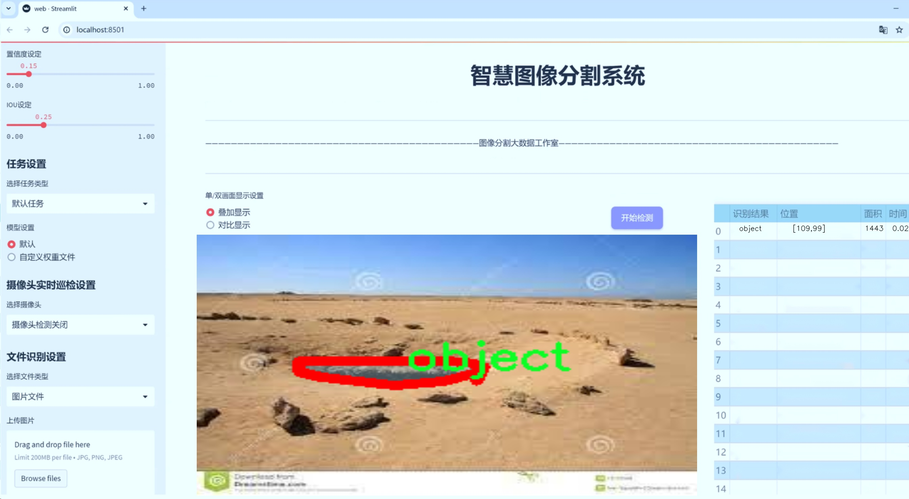
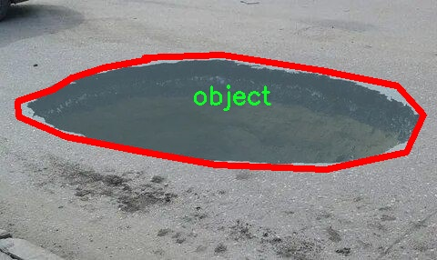
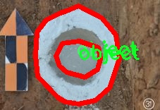
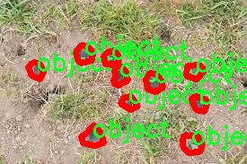
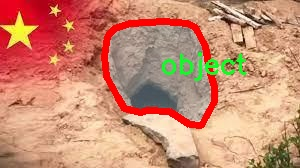
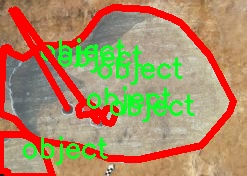

# 考古坑洞私挖盗洞图像分割系统： yolov8-seg-act

### 1.研究背景与意义

[参考博客](https://gitee.com/YOLOv8_YOLOv11_Segmentation_Studio/projects)

[博客来源](https://kdocs.cn/l/cszuIiCKVNis)

研究背景与意义

随着全球对文化遗产保护意识的增强，考古学作为一门研究人类历史与文化的重要学科，面临着日益严峻的挑战。尤其是在一些文化遗产丰富的地区，私挖盗洞现象屡见不鲜，这不仅对考古遗址的完整性造成了严重威胁，也对当地的生态环境和社会秩序产生了负面影响。因此，开发高效的监测与识别系统，以及时发现和制止私挖盗洞行为，成为当前考古学研究与文化遗产保护的重要任务之一。

在这一背景下，图像分割技术的应用显得尤为重要。图像分割不仅可以帮助研究人员从复杂的背景中提取出考古坑洞和盗洞的相关信息，还能够为后续的分析与决策提供重要依据。近年来，深度学习技术的快速发展为图像分割领域带来了新的机遇，尤其是基于YOLO（You Only Look Once）系列模型的实例分割方法，因其高效性和准确性而受到广泛关注。YOLOv8作为该系列的最新版本，具备了更强的特征提取能力和实时处理能力，适合在复杂的考古环境中进行应用。

本研究旨在基于改进的YOLOv8模型，构建一个专门针对考古坑洞和私挖盗洞的图像分割系统。我们将利用包含1500张图像的“looting-hole”数据集进行训练和测试，该数据集专注于盗洞这一特定类别，为模型的训练提供了丰富的样本支持。通过对该数据集的深入分析，我们将探讨如何优化YOLOv8模型的参数设置，以提高其在考古现场的应用效果。

研究的意义不仅体现在技术层面，更在于其对考古学和文化遗产保护的实际贡献。首先，基于改进YOLOv8的图像分割系统能够实现对考古现场的实时监测，及时发现潜在的盗洞行为，从而为相关部门提供决策支持。其次，该系统的推广应用将提升公众对文化遗产保护的意识，促使更多人参与到保护工作中来，形成全社会共同维护文化遗产的良好氛围。此外，研究成果还将为其他领域的图像分割应用提供借鉴，推动相关技术的进一步发展。

综上所述，基于改进YOLOv8的考古坑洞私挖盗洞图像分割系统的研究，不仅具有重要的学术价值，也为实际的文化遗产保护工作提供了切实可行的技术手段。通过这一研究，我们期望能够为考古学界和文化遗产保护领域提供新的思路和方法，助力于实现对人类历史文化的有效保护与传承。

### 2.图片演示







注意：本项目提供完整的训练源码数据集和训练教程,由于此博客编辑较早,暂不提供权重文件（best.pt）,需要按照6.训练教程进行训练后实现上图效果。

### 3.视频演示

[3.1 视频演示](https://www.bilibili.com/video/BV1JTzqY3Epf/)

### 4.数据集信息

##### 4.1 数据集类别数＆类别名

nc: 1
names: ['object']


##### 4.2 数据集信息简介

数据集信息展示

在考古学研究和文化遗产保护领域，私挖盗洞的现象日益严重，给考古遗址的完整性和文物的安全性带来了巨大的威胁。为了有效地识别和监测这些非法活动，开发一个高效的图像分割系统显得尤为重要。本研究所使用的数据集名为“looting-hole”，专门针对考古坑洞和私挖盗洞的图像分割任务而构建。该数据集的设计旨在为改进YOLOv8-seg模型提供高质量的训练样本，从而提升其在复杂环境下的检测和分割能力。

“looting-hole”数据集包含了大量与考古盗洞相关的图像，这些图像经过精心挑选和标注，确保其在训练过程中能够有效地帮助模型学习到特征。数据集中包含的类别数量为1，具体类别为“object”，这意味着所有的图像均围绕着一个核心目标展开，即盗洞的检测与分割。通过集中关注这一类别，研究者能够深入挖掘盗洞的特征，从而提高模型在实际应用中的准确性和鲁棒性。

在数据集的构建过程中，研究团队采用了多种数据采集方法，包括实地拍摄、无人机航拍以及从相关文献和数据库中获取的图像。这些图像涵盖了不同的地理位置、季节和光照条件，确保了数据集的多样性和代表性。此外，为了提高模型的泛化能力，数据集中还包含了各种类型的盗洞，包括不同大小、形状和深度的坑洞。这种多样性使得模型在面对不同场景时，能够更好地适应并进行准确的分割。

数据集的标注工作同样至关重要。研究团队通过专业的标注工具，对每一张图像中的盗洞进行了精确的标注，确保模型在训练过程中能够学习到清晰的边界和特征。这一过程不仅需要专业知识，还需要对考古学和盗洞特征的深入理解，以确保标注的准确性和一致性。通过高质量的标注，数据集为模型提供了坚实的基础，使其能够在训练后有效地识别和分割盗洞。

为了验证数据集的有效性，研究团队还进行了多轮的实验，评估模型在不同测试集上的表现。实验结果表明，基于“looting-hole”数据集训练的YOLOv8-seg模型在盗洞的检测和分割任务中表现出色，具有较高的准确率和召回率。这一成果不仅证明了数据集的实用性，也为未来的考古遗址保护提供了新的技术手段。

总之，“looting-hole”数据集为考古坑洞和私挖盗洞的图像分割研究提供了重要的支持。通过精心的设计和标注，该数据集不仅提升了YOLOv8-seg模型的性能，也为相关领域的研究者提供了宝贵的资源。随着技术的不断进步和数据集的进一步完善，期待在未来能够更有效地保护我们的文化遗产，减少盗洞对考古遗址的影响。











### 5.项目依赖环境部署教程（零基础手把手教学）

[5.1 环境部署教程链接（零基础手把手教学）](https://www.bilibili.com/video/BV1jG4Ve4E9t/?vd_source=bc9aec86d164b67a7004b996143742dc)


[5.2 安装Python虚拟环境创建和依赖库安装视频教程链接（零基础手把手教学）](https://www.bilibili.com/video/BV1nA4VeYEze/?vd_source=bc9aec86d164b67a7004b996143742dc)

### 6.手把手YOLOV8-seg训练视频教程（零基础手把手教学）

[6.1 手把手YOLOV8-seg训练视频教程（零基础小白有手就能学会）](https://www.bilibili.com/video/BV1cA4VeYETe/?vd_source=bc9aec86d164b67a7004b996143742dc)


按照上面的训练视频教程链接加载项目提供的数据集，运行train.py即可开始训练



     Epoch   gpu_mem       box       obj       cls    labels  img_size
     1/200     0G   0.01576   0.01955  0.007536        22      1280: 100%|██████████| 849/849 [14:42<00:00,  1.04s/it]
               Class     Images     Labels          P          R     mAP@.5 mAP@.5:.95: 100%|██████████| 213/213 [01:14<00:00,  2.87it/s]
                 all       3395      17314      0.994      0.957      0.0957      0.0843

     Epoch   gpu_mem       box       obj       cls    labels  img_size
     2/200     0G   0.01578   0.01923  0.007006        22      1280: 100%|██████████| 849/849 [14:44<00:00,  1.04s/it]
               Class     Images     Labels          P          R     mAP@.5 mAP@.5:.95: 100%|██████████| 213/213 [01:12<00:00,  2.95it/s]
                 all       3395      17314      0.996      0.956      0.0957      0.0845

     Epoch   gpu_mem       box       obj       cls    labels  img_size
     3/200     0G   0.01561    0.0191  0.006895        27      1280: 100%|██████████| 849/849 [10:56<00:00,  1.29it/s]
               Class     Images     Labels          P          R     mAP@.5 mAP@.5:.95: 100%|███████   | 187/213 [00:52<00:00,  4.04it/s]
                 all       3395      17314      0.996      0.957      0.0957      0.0845


### 7.50+种全套YOLOV8-seg创新点加载调参实验视频教程（一键加载写好的改进模型的配置文件）

[7.1 50+种全套YOLOV8-seg创新点加载调参实验视频教程（一键加载写好的改进模型的配置文件）](https://www.bilibili.com/video/BV1Hw4VePEXv/?vd_source=bc9aec86d164b67a7004b996143742dc)

### YOLOV8-seg算法简介

原始YOLOv8-seg算法原理

YOLOv8-seg算法是YOLO系列模型的最新进展，结合了目标检测与图像分割的能力，展现出在实时应用中的强大潜力。该算法在YOLOv8的基础上进行了优化和扩展，旨在提高图像分割任务的精度和效率。YOLOv8-seg的设计理念是通过将目标检测与语义分割相结合，实现对复杂场景中目标的精准定位和细致描绘。

YOLOv8-seg的网络结构由三个主要部分组成：Backbone、Neck和Head。Backbone部分负责特征提取，采用了先进的CSPDarknet结构，通过多个残差块的堆叠，能够有效地捕捉图像中的多层次特征。这一过程不仅提高了特征提取的深度和宽度，还通过C2f模块的引入，增强了模型对特征的表达能力。C2f模块的设计使得输入特征图被分为多个分支，每个分支独立处理并融合，形成更为丰富的特征表示。这种结构的优势在于它能够有效地保留细粒度的上下文信息，为后续的分割任务奠定了坚实的基础。

在Neck部分，YOLOv8-seg采用了路径聚合网络（PAN）结构，通过上采样和下采样的方式实现不同尺度特征的融合。这一过程使得模型能够在不同的特征层次上进行信息的整合，提升了对目标的感知能力。特别是在处理复杂背景和小目标时，Neck结构的设计显得尤为重要。它不仅提高了特征的表达能力，还通过多尺度特征的融合，增强了模型对不同大小目标的检测能力。

Head部分则是YOLOv8-seg的核心，负责将提取到的特征转换为最终的检测和分割结果。与传统的锚框方法不同，YOLOv8-seg采用了无锚框（Anchor-Free）的方法，直接预测目标的中心点和宽高比例。这一创新使得模型在检测速度和准确度上都得到了显著提升。YOLOv8-seg的Head结构还实现了分类和回归过程的解耦，通过正负样本的匹配和损失计算，进一步优化了模型的训练过程。

在损失函数的设计上，YOLOv8-seg结合了多种损失计算方法，包括二元交叉熵损失（BCE）和分布焦点损失（DFL），以确保分类和回归的精度。同时，采用了改进的CIoU损失函数，提升了模型的泛化能力。这些设计不仅提高了模型在训练过程中的稳定性，也增强了其在实际应用中的表现。

值得注意的是，YOLOv8-seg在处理复杂场景时，特别是在水面等动态环境中，依然面临着一些挑战。例如，小目标的漂浮物特征复杂，背景多样，可能导致定位误差和目标感知能力不足。为了解决这些问题，YOLOv8-seg在算法设计中引入了BiFormer双层路由注意力机制，旨在减轻主干网络下采样过程中的噪声影响，从而保留更多的细粒度上下文信息。此外，为了提升对小目标的感知能力，YOLOv8-seg还在Head部分添加了更小的检测头，确保模型能够有效地捕捉到细小的目标。

YOLOv8-seg的训练过程采用了多种数据增强技术，包括Mosaic数据增强、自适应图片缩放和灰度填充等，以提高模型的鲁棒性和适应性。这些技术的应用不仅丰富了训练数据的多样性，还增强了模型对不同场景的适应能力。通过这种方式，YOLOv8-seg能够在多种复杂环境下实现高效的目标检测和图像分割，展现出其在实际应用中的广泛前景。

综上所述，YOLOv8-seg算法通过对YOLOv8的结构和功能进行优化，成功地将目标检测与图像分割相结合，形成了一种高效、准确的深度学习模型。其创新的网络结构、灵活的损失函数设计以及强大的特征提取能力，使得YOLOv8-seg在复杂场景中的表现尤为突出，成为了当前计算机视觉领域中的一项重要技术。随着对YOLOv8-seg算法的不断研究和应用，其在实际场景中的潜力将进一步得到挖掘，为各类视觉任务提供更加精准和高效的解决方案。


### 9.系统功能展示（检测对象为举例，实际内容以本项目数据集为准）

图9.1.系统支持检测结果表格显示

  图9.2.系统支持置信度和IOU阈值手动调节

  图9.3.系统支持自定义加载权重文件best.pt(需要你通过步骤5中训练获得)

  图9.4.系统支持摄像头实时识别

  图9.5.系统支持图片识别

  图9.6.系统支持视频识别

  图9.7.系统支持识别结果文件自动保存

  图9.8.系统支持Excel导出检测结果数据


### 10.50+种全套YOLOV8-seg创新点原理讲解（非科班也可以轻松写刊发刊，V11版本正在科研待更新）

#### 10.1 由于篇幅限制，每个创新点的具体原理讲解就不一一展开，具体见下列网址中的创新点对应子项目的技术原理博客网址【Blog】：


[10.1 50+种全套YOLOV8-seg创新点原理讲解链接](https://gitee.com/qunmasj/good)

#### 10.2 部分改进模块原理讲解(完整的改进原理见上图和技术博客链接)【如果此小节的图加载失败可以通过CSDN或者Github搜索该博客的标题访问原始博客，原始博客图片显示正常】
### YOLOv8简介

YOLOv8是一种最新的SOTA算法，提供了N/S/M/L/X尺度的不同大小模型，以满足不同场景的需求。本章对算法网络的新特性进行简要介绍。


1）骨干网络和Neck
开发者设计了C2f模块对CSPDarkNet 53和PAFPN进行改造。相比C3模块，C2f模块拥有更多的分支跨层链接，使模型的梯度流更加丰富，显著增强了模型的特征提取能力。
2)Head部分
Head部分采用无锚框设计，将分类任务和回归任务进行了解耦，独立的分支将更加专注于其所负责的特征信息。
3）损失计算
模型使用CIOU Loss作为误差损失函数，并通过最小化DFL进一步提升边界框的回归精度。同时模型采用了TaskAlignedAssigner样本分配策略，以分类得分和IOU的高阶组合作为指标指导正负样本选择，实现了高分类得分和高IOU的对齐，有效地提升了模型的检测精度。


### D-LKA Attention简介
自2010年代中期以来，卷积神经网络（CNNs）已成为许多计算机视觉应用的首选技术。它们能够从原始数据中自动提取复杂的特征表示，无需手动进行特征工程，这引起了医学图像分析社区的极大兴趣。许多成功的CNN架构，如U-Net、全卷积网络、DeepLab或SegCaps（分割胶囊），已经被开发出来。这些架构在语义分割任务中取得了巨大成功，先前的最新方法已经被超越。

在计算机视觉研究中，不同尺度下的目标识别是一个关键问题。在CNN中，可检测目标的大小与相应网络层的感受野尺寸密切相关。如果一个目标扩展到超出这个感受野的边界，这可能会导致欠分割结果。相反，与目标实际大小相比使用过大的感受野可能会限制识别，因为背景信息可能会对预测产生不必要的影响。

解决这个问题的一个有希望的方法涉及在并行使用具有不同尺寸的多个Kernel，类似于Inception块的机制。然而，由于参数和计算要求的指数增长，将Kernel大小增加以容纳更大的目标在实践中受到限制。因此，出现了各种策略，包括金字塔池化技术和不同尺度的扩张卷积，以捕获多尺度的上下文信息。

另一个直观的概念涉及将多尺度图像金字塔或它们的相关特征表示直接纳入网络架构。然而，这种方法存在挑战，特别是在管理训练和推理时间方面的可行性方面存在挑战。在这个背景下，使用编码器-解码器网络，如U-Net，已被证明是有利的。这样的网络在较浅的层中编码外观和位置，而在更深的层中，通过神经元的更广泛的感受野捕获更高的语义信息和上下文信息。

一些方法将来自不同层的特征组合在一起，或者预测来自不同尺寸的层的特征以使用多尺度的信息。此外，出现了从不同尺度的层中预测特征的方法，有效地实现了跨多个尺度的见解整合。然而，大多数编码器-解码器结构面临一个挑战：它们经常无法在不同尺度之间保持一致的特征，并主要使用最后一个解码器层生成分割结果。

语义分割是一项任务，涉及根据预定义的标签集为图像中的每个像素预测语义类别。这项任务要求提取高级特征同时保留初始的空间分辨率。CNNs非常适合捕获局部细节和低级信息，尽管以忽略全局上下文为代价。视觉Transformer（ViT）架构已经成为解决处理全局信息的视觉任务的关键，包括语义分割，取得了显著的成功。

ViT的基础是注意力机制，它有助于在整个输入序列上聚合信息。这种能力使网络能够合并远程的上下文提示，超越了CNN的有限感受野尺寸。然而，这种策略通常会限制ViT有效建模局部信息的能力。这种局限可能会妨碍它们检测局部纹理的能力，这对于各种诊断和预测任务至关重要。这种缺乏局部表示可以归因于ViT模型处理图像的特定方式。

ViT模型将图像分成一系列Patch，并使用自注意力机制来模拟它们之间的依赖关系。这种方法可能不如CNN模型中的卷积操作对感受野内提取局部特征有效。ViT和CNN模型之间的这种图像处理方法的差异可能解释了CNN模型在局部特征提取方面表现出色的原因。

近年来，已经开发出创新性方法来解决Transformer模型内部局部纹理不足的问题。其中一种方法是通过互补方法将CNN和ViT特征结合起来，以结合它们的优势并减轻局部表示的不足。TransUNet是这种方法的早期示例，它在CNN的瓶颈中集成了Transformer层，以模拟局部和全局依赖关系。HiFormer提出了一种解决方案，将Swin Transformer模块和基于CNN的编码器结合起来，生成两个多尺度特征表示，通过Double-Level Fusion模块集成。UNETR使用基于Transformer的编码器和CNN解码器进行3D医学图像分割。CoTr和TransBTS通过Transformer在低分辨率阶段增强分割性能，将CNN编码器和解码器连接在一起。

增强局部特征表示的另一种策略是重新设计纯Transformer模型内部的自注意力机制。在这方面，Swin-Unet在U形结构中集成了一个具有线性计算复杂性的Swin Transformer块作为多尺度 Backbone 。MISSFormer采用高效Transformer来解决视觉Transformer中的参数问题，通过在输入块上进行不可逆的降采样操作。D-Former引入了一个纯Transformer的管道，具有双重注意模块，以分段的方式捕获细粒度的局部注意和与多元单元的交互。然而，仍然存在一些特定的限制，包括计算效率低下，如TransUNet模型所示，对CNN Backbone 的严重依赖，如HiFormer所观察到的，以及对多尺度信息的忽略。

此外，目前的分割架构通常采用逐层处理3D输入 volumetric 的方法，无意中忽视了相邻切片之间的潜在相关性。这一疏忽限制了对 volumetric 信息的全面利用，因此损害了定位精度和上下文集成。此外，必须认识到，医学领域的病变通常在形状上发生变形。因此，用于医学图像分析的任何学习算法都必须具备捕捉和理解这些变形的能力。与此同时，该算法应保持计算效率，以便处理3D volumetric数据。

为了解决上述提到的挑战，作者提出了一个解决方案，即可变形大卷积核注意力模块（Deformable LKA module），它是作者网络设计的基本构建模块。这个模块明确设计成在有效处理上下文信息的同时保留局部描述符。作者的架构在这两个方面的平衡增强了实现精确语义分割的能力。

值得注意的是，参考该博客引入了一种基于数据的感受野的动态适应，不同于传统卷积操作中的固定滤波器Mask。这种自适应方法使作者能够克服与静态方法相关的固有限制。这种创新方法还扩展到了D-LKA Net架构的2D和3D版本的开发。

在3D模型的情况下，D-LKA机制被量身定制以适应3D环境，从而实现在不同 volumetric 切片之间无缝信息交互。最后，作者的贡献通过其计算效率得到进一步强调。作者通过仅依靠D-LKA概念的设计来实现这一点，在各种分割基准上取得了显著的性能，确立了作者的方法作为一种新的SOTA方法。

在本节中，作者首先概述方法论。首先，作者回顾了由Guo等人引入的大卷积核注意力（Large Kernel Attention，LKA）的概念。然后，作者介绍了作者对可变形LKA模块的创新探索。在此基础上，作者介绍了用于分割任务的2D和3D网络架构。

大卷积核提供了与自注意力机制类似的感受野。可以通过使用深度卷积、深度可扩展卷积和卷积来构建大卷积核，从而减少了参数和计算量。构建输入维度为和通道数的卷积核的深度卷积和深度可扩展卷积的卷积核大小的方程如下：


具有卷积核大小和膨胀率。参数数量和浮点运算（FLOPs）的计算如下：


FLOPs的数量与输入图像的大小成线性增长。参数的数量随通道数和卷积核大小的增加而呈二次增长。然而，由于它们通常都很小，因此它们不是限制因素。

为了最小化对于固定卷积核大小K的参数数量，可以将方程3对于膨胀率的导数设定为零：


例如，当卷积核大小为时，结果是。将这些公式扩展到3D情况是直接的。对于大小为和通道数C的输入，3D情况下参数数量和FLOPs 的方程如下：


具有卷积核大小和膨胀。


利用大卷积核进行医学图像分割的概念通过引入可变形卷积得以扩展。可变形卷积可以通过整数偏移自由调整采样网格以进行自由变形。额外的卷积层从特征图中学习出变形，从而创建一个偏移场。基于特征本身学习变形会导致自适应卷积核。这种灵活的卷积核形状可以提高病变或器官变形的表示，从而增强了目标边界的定义。

负责计算偏移的卷积层遵循其相应卷积层的卷积核大小和膨胀。双线性插值用于计算不在图像网格上的偏移的像素值。如图2所示，D-LKA模块可以表示为：


其中输入特征由表示，。表示为注意力图，其中每个值表示相应特征的相对重要性。运算符  表示逐元素乘法运算。值得注意的是，LKA不同于传统的注意力方法，它不需要额外的规范化函数，如或。这些规范化函数往往忽视高频信息，从而降低了基于自注意力的方法的性能。

在该方法的2D版本中，卷积层被可变形卷积所替代，因为可变形卷积能够改善对具有不规则形状和大小的目标的捕捉能力。这些目标在医学图像数据中常常出现，因此这种增强尤为重要。

然而，将可变形LKA的概念扩展到3D领域会带来一定的挑战。主要的约束来自于需要用于生成偏移的额外卷积层。与2D情况不同，由于输入和输出通道的性质，这一层无法以深度可分的方式执行。在3D环境中，输入通道对应于特征，而输出通道扩展到，其中是卷积核的大小。大卷积核的复杂性导致沿第3D的通道数扩展，导致参数和FLOPs大幅增加。因此，针对3D情况采用了另一种替代方法。在现有的LKA框架中，深度卷积之后引入了一个单独的可变形卷积层。这种战略性的设计调整旨在减轻扩展到3D领域所带来的挑战。


2D网络的架构如图1所示。第一变种使用MaxViT作为编码器组件，用于高效特征提取，而第二变种则结合可变形LKA层进行更精细、卓越的分割。

在更正式的描述中，编码器生成4个分层输出表示。首先，卷积干扰将输入图像的维度减小到。随后，通过4个MaxViT块的4个阶段进行特征提取，每个阶段后跟随降采样层。随着过程进展到解码器，实施了4个阶段的D-LKA层，每个阶段包含2个D-LKA块。然后，应用Patch扩展层以实现分辨率上采样，同时减小通道维度。最后，线性层负责生成最终的输出。

2D D-LKA块的结构包括LayerNorm、可变形LKA和多层感知器（MLP）。积分残差连接确保了有效的特征传播，即使在更深层也是如此。这个安排可以用数学方式表示为：


其中输入特征，层归一化LN，可变形LKA注意力，深度卷积，线性层和GeLU激活函数。

3D网络架构如图1所示，采用编码器-解码器设计进行分层结构化。首先，一个Patch嵌入层将输入图像的维度从（）减小到（）。在编码器中，采用了3个D-LKA阶段的序列，每个阶段包含3个D-LKA块。在每个阶段之后，通过降采样步骤将空间分辨率减半，同时将通道维度加倍。中央瓶颈包括另一组2个D-LKA块。解码器结构与编码器相对称。

为了将特征分辨率加倍，同时减少通道数，使用转置卷积。每个解码器阶段都使用3个D-LKA块来促进远距离特征依赖性。最终的分割输出由一个卷积层产生，后面跟随一个卷积层以匹配特定类别的通道要求。

为了建立输入图像和分割输出之间的直接连接，使用卷积形成了一个跳跃连接。额外的跳跃连接根据简单的加法对来自其他阶段的特征进行融合。最终的分割图是通过和卷积层的组合产生的。

3D D-LKA块包括层归一化，后跟D-LKA注意力，应用了残差连接的部分。随后的部分采用了一个卷积层，后面跟随一个卷积层，两者都伴随着残差连接。这个整个过程可以总结如下：


带有输入特征 、层归一化 、可变形 LKA 、卷积层 和输出特征 的公式。是指一个前馈网络，包括2个卷积层和激活函数。

表7显示了普通卷积和构建卷积的参数数量比较。尽管标准卷积的参数数量在通道数较多时急剧增加，但分解卷积的参数总体较低，并且增长速度不那么快。

与分解卷积相比，可变形分解卷积增加了大量参数，但仍然明显小于标准卷积。可变形卷积的主要参数是由偏移网络创建的。在这里，作者假设可变形深度卷积的Kernel大小为（5,5），可变形深度空洞卷积的Kernel大小为（7,7）。这导致了21×21大小的大Kernel的最佳参数数量。更高效地生成偏移量的方法将大大减少参数数量。


值得注意的是，引入可变形LKA确实会增加模型的参数数量和每秒的浮点运算次数（FLOPS）。然而，重要的是强调，这增加的计算负载不会影响作者模型的整体推理速度。

相反，对于Batch-size > 1，作者甚至观察到推理时间的减少，如图7所示。例如，基于作者的广泛实验，作者观察到对于Batch-size为16，具有可变形卷积和没有可变形卷积的推理时间分别为8.01毫秒和17.38毫秒。作者认为这是由于在2D中对可变形卷积的高效实现所致。为了测量时间，使用了大小为（）的随机输入。在GPU热身周期50次迭代之后，网络被推断了1000次。测量是在NVIDIA RTX 3090 GPU上进行的。


为了充分利用性能与参数之间的权衡关系，作者在图8中可视化了在Synapse 2D数据集上报告的DSC和HD性能以及基于参数数量的内存消耗。D-LKA Net引入了相当多的参数，约为101M。这比性能第二好的方法ScaleFormer使用的111.6M参数要少。

与更轻量级的DAEFormer模型相比，作者实现了更好的性能，这证明了参数增加的合理性。大多数参数来自于MaxViT编码器；因此，将编码器替换为更高效的编码器可以减少模型参数。值得注意的是，在此可视化中，作者最初将HD和内存值都归一化到[0, 100]范围内。随后，作者将它们从100缩小，以增强更高值的表示。


### 11.项目核心源码讲解（再也不用担心看不懂代码逻辑）

#### 11.1 ultralytics\models\sam\build.py

以下是经过简化和注释的核心代码部分：

```python
import torch
from functools import partial
from ultralytics.utils.downloads import attempt_download_asset
from .modules.decoders import MaskDecoder
from .modules.encoders import ImageEncoderViT, PromptEncoder
from .modules.sam import Sam
from .modules.tiny_encoder import TinyViT
from .modules.transformer import TwoWayTransformer

def build_sam_vit_h(checkpoint=None):
    """构建并返回一个高尺寸的Segment Anything Model (SAM)。"""
    return _build_sam(
        encoder_embed_dim=1280,  # 嵌入维度
        encoder_depth=32,         # 编码器深度
        encoder_num_heads=16,     # 注意力头数量
        encoder_global_attn_indexes=[7, 15, 23, 31],  # 全局注意力索引
        checkpoint=checkpoint,
    )

def _build_sam(encoder_embed_dim, encoder_depth, encoder_num_heads, encoder_global_attn_indexes, checkpoint=None, mobile_sam=False):
    """构建所选的SAM模型架构。"""
    prompt_embed_dim = 256  # 提示嵌入维度
    image_size = 1024       # 输入图像大小
    vit_patch_size = 16     # ViT的补丁大小
    image_embedding_size = image_size // vit_patch_size  # 图像嵌入大小

    # 根据是否为移动SAM选择不同的图像编码器
    image_encoder = (TinyViT(
        img_size=image_size,
        in_chans=3,
        num_classes=1000,
        embed_dims=encoder_embed_dim,
        depths=encoder_depth,
        num_heads=encoder_num_heads,
        window_sizes=[7, 7, 14, 7],
        mlp_ratio=4.0,
        drop_rate=0.0,
        drop_path_rate=0.0,
        use_checkpoint=False,
        mbconv_expand_ratio=4.0,
        local_conv_size=3,
    ) if mobile_sam else ImageEncoderViT(
        depth=encoder_depth,
        embed_dim=encoder_embed_dim,
        img_size=image_size,
        mlp_ratio=4,
        norm_layer=partial(torch.nn.LayerNorm, eps=1e-6),
        num_heads=encoder_num_heads,
        patch_size=vit_patch_size,
        qkv_bias=True,
        use_rel_pos=True,
        global_attn_indexes=encoder_global_attn_indexes,
        window_size=14,
        out_chans=prompt_embed_dim,
    ))

    # 创建SAM模型
    sam = Sam(
        image_encoder=image_encoder,
        prompt_encoder=PromptEncoder(
            embed_dim=prompt_embed_dim,
            image_embedding_size=(image_embedding_size, image_embedding_size),
            input_image_size=(image_size, image_size),
            mask_in_chans=16,
        ),
        mask_decoder=MaskDecoder(
            num_multimask_outputs=3,
            transformer=TwoWayTransformer(
                depth=2,
                embedding_dim=prompt_embed_dim,
                mlp_dim=2048,
                num_heads=8,
            ),
            transformer_dim=prompt_embed_dim,
            iou_head_depth=3,
            iou_head_hidden_dim=256,
        ),
        pixel_mean=[123.675, 116.28, 103.53],  # 像素均值
        pixel_std=[58.395, 57.12, 57.375],      # 像素标准差
    )

    # 如果提供了检查点，则加载模型权重
    if checkpoint is not None:
        checkpoint = attempt_download_asset(checkpoint)  # 尝试下载检查点
        with open(checkpoint, 'rb') as f:
            state_dict = torch.load(f)  # 加载权重
        sam.load_state_dict(state_dict)  # 加载状态字典
    sam.eval()  # 设置模型为评估模式
    return sam  # 返回构建的SAM模型

# 模型构建映射
sam_model_map = {
    'sam_h.pt': build_sam_vit_h,
    # 其他模型构建函数...
}

def build_sam(ckpt='sam_b.pt'):
    """根据指定的检查点构建SAM模型。"""
    model_builder = None
    ckpt = str(ckpt)  # 转换为字符串以支持Path类型
    for k in sam_model_map.keys():
        if ckpt.endswith(k):
            model_builder = sam_model_map.get(k)  # 获取对应的模型构建函数

    if not model_builder:
        raise FileNotFoundError(f'{ckpt} 不是一个支持的SAM模型。可用模型有: \n {sam_model_map.keys()}')

    return model_builder(ckpt)  # 返回构建的模型
```

### 代码核心部分说明：
1. **模型构建函数**：提供了不同尺寸的SAM模型构建函数（如`build_sam_vit_h`），这些函数调用了核心的`_build_sam`函数。
2. **_build_sam函数**：这是构建SAM模型的核心函数，负责创建图像编码器、提示编码器和掩码解码器，并加载预训练权重。
3. **模型映射**：`sam_model_map`字典将模型文件名映射到相应的构建函数，以便根据文件名动态构建模型。
4. **build_sam函数**：根据给定的检查点文件名构建相应的SAM模型，提供了简单的接口来获取模型。

这个文件是用于构建“Segment Anything Model”（SAM）的Python脚本，主要包含了一些函数和模型的定义。首先，文件导入了一些必要的库和模块，包括PyTorch和Ultralytics库中的一些工具和模型组件。

文件中定义了多个构建函数，如`build_sam_vit_h`、`build_sam_vit_l`、`build_sam_vit_b`和`build_mobile_sam`，这些函数分别用于构建不同大小的SAM模型。每个函数调用了一个内部的`_build_sam`函数，并传入不同的参数来设置模型的架构，例如编码器的嵌入维度、深度、头数等。这些参数决定了模型的复杂性和性能。

`_build_sam`函数是构建SAM模型的核心部分。它根据传入的参数初始化图像编码器和其他组件。对于移动版本的SAM，它使用`TinyViT`作为图像编码器；而对于标准版本，则使用`ImageEncoderViT`。该函数还创建了一个`Sam`对象，该对象整合了图像编码器、提示编码器和掩码解码器等模块。

在模型构建过程中，`_build_sam`函数还处理了模型的预训练权重。如果提供了检查点路径，函数会尝试下载并加载该检查点中的权重，以便于初始化模型的状态。

最后，文件中定义了一个`sam_model_map`字典，将不同的模型文件名映射到相应的构建函数。`build_sam`函数根据传入的检查点名称查找对应的构建函数，并调用它来构建模型。如果传入的检查点不在支持的模型列表中，函数会抛出一个文件未找到的异常。

总的来说，这个文件的主要功能是提供一个灵活的接口，用于构建和初始化不同配置的SAM模型，以便在后续的图像分割任务中使用。

#### 11.2 ultralytics\trackers\basetrack.py

以下是代码中最核心的部分，并附上详细的中文注释：

```python
from collections import OrderedDict
import numpy as np

class TrackState:
    """对象跟踪状态的枚举类。"""
    New = 0      # 新跟踪
    Tracked = 1  # 正在跟踪
    Lost = 2     # 跟踪丢失
    Removed = 3  # 跟踪已移除

class BaseTrack:
    """对象跟踪的基类，处理基本的跟踪属性和操作。"""

    _count = 0  # 全局跟踪ID计数器

    track_id = 0          # 跟踪ID
    is_activated = False   # 跟踪是否被激活
    state = TrackState.New # 当前跟踪状态

    history = OrderedDict() # 跟踪历史记录
    features = []           # 特征列表
    curr_feature = None     # 当前特征
    score = 0              # 跟踪得分
    start_frame = 0        # 开始帧
    frame_id = 0           # 当前帧ID
    time_since_update = 0   # 自上次更新以来的时间

    # 多摄像头位置
    location = (np.inf, np.inf) # 初始位置为无穷大

    @property
    def end_frame(self):
        """返回跟踪的最后帧ID。"""
        return self.frame_id

    @staticmethod
    def next_id():
        """递增并返回全局跟踪ID计数器。"""
        BaseTrack._count += 1
        return BaseTrack._count

    def activate(self, *args):
        """使用提供的参数激活跟踪。"""
        raise NotImplementedError  # 该方法需要在子类中实现

    def predict(self):
        """预测跟踪的下一个状态。"""
        raise NotImplementedError  # 该方法需要在子类中实现

    def update(self, *args, **kwargs):
        """使用新的观测值更新跟踪。"""
        raise NotImplementedError  # 该方法需要在子类中实现

    def mark_lost(self):
        """将跟踪标记为丢失。"""
        self.state = TrackState.Lost

    def mark_removed(self):
        """将跟踪标记为已移除。"""
        self.state = TrackState.Removed

    @staticmethod
    def reset_id():
        """重置全局跟踪ID计数器。"""
        BaseTrack._count = 0
```

### 代码核心部分说明：
1. **TrackState 类**：定义了跟踪状态的枚举，包括新跟踪、正在跟踪、丢失和已移除的状态。
2. **BaseTrack 类**：这是一个对象跟踪的基类，包含了跟踪的基本属性和方法。它维护了跟踪的状态、ID、历史记录、特征等信息。
3. **静态方法**：
   - `next_id()`：用于生成唯一的跟踪ID。
   - `reset_id()`：用于重置跟踪ID计数器。
4. **实例方法**：
   - `activate()`、`predict()`、`update()`：这些方法是抽象方法，子类需要实现具体的逻辑。
   - `mark_lost()` 和 `mark_removed()`：用于更新跟踪状态为丢失或已移除。

这个程序文件定义了一个用于对象跟踪的基础类`BaseTrack`，以及一个用于表示跟踪状态的枚举类`TrackState`。`TrackState`类中定义了四种可能的跟踪状态：新建（New）、跟踪中（Tracked）、丢失（Lost）和已移除（Removed），这些状态用于表示对象在跟踪过程中的不同情况。

`BaseTrack`类是一个对象跟踪的基类，负责处理基本的跟踪属性和操作。类中定义了一些属性，例如`track_id`（跟踪ID）、`is_activated`（是否激活）、`state`（当前状态）、`history`（跟踪历史）、`features`（特征）、`curr_feature`（当前特征）、`score`（得分）、`start_frame`（起始帧）、`frame_id`（当前帧ID）、`time_since_update`（自上次更新以来的时间）以及`location`（多摄像头下的位置）。

类中还定义了一个只读属性`end_frame`，用于返回跟踪的最后一帧ID。`next_id`静态方法用于递增并返回全局跟踪ID计数器，以确保每个跟踪对象都有唯一的ID。`activate`、`predict`和`update`方法是抽象方法，意味着在子类中需要实现这些方法，以便激活跟踪、预测下一个状态和更新跟踪信息。

此外，`mark_lost`和`mark_removed`方法用于将跟踪状态标记为丢失或已移除。最后，`reset_id`静态方法用于重置全局跟踪ID计数器，方便在需要时重新开始跟踪。

整体来看，这个文件为对象跟踪提供了一个基础框架，后续可以通过继承`BaseTrack`类来实现具体的跟踪算法和逻辑。

#### 11.3 ultralytics\models\sam\amg.py

以下是代码中最核心的部分，并附上详细的中文注释：

```python
import torch
import numpy as np

def is_box_near_crop_edge(boxes: torch.Tensor,
                          crop_box: List[int],
                          orig_box: List[int],
                          atol: float = 20.0) -> torch.Tensor:
    """
    判断给定的边界框是否接近裁剪边缘。

    参数:
    - boxes: 需要判断的边界框，格式为 (N, 4)，N为边界框数量，4表示(x1, y1, x2, y2)。
    - crop_box: 当前裁剪框的坐标，格式为 [x0, y0, x1, y1]。
    - orig_box: 原始图像的边界框坐标，格式为 [x0, y0, x1, y1]。
    - atol: 允许的绝对误差，默认为20.0。

    返回:
    - 返回一个布尔张量，表示每个边界框是否接近裁剪边缘。
    """
    crop_box_torch = torch.as_tensor(crop_box, dtype=torch.float, device=boxes.device)
    orig_box_torch = torch.as_tensor(orig_box, dtype=torch.float, device=boxes.device)
    
    # 将边界框从裁剪坐标系转换回原始坐标系
    boxes = uncrop_boxes_xyxy(boxes, crop_box).float()
    
    # 判断边界框是否接近裁剪框的边缘
    near_crop_edge = torch.isclose(boxes, crop_box_torch[None, :], atol=atol, rtol=0)
    # 判断边界框是否接近原始图像的边缘
    near_image_edge = torch.isclose(boxes, orig_box_torch[None, :], atol=atol, rtol=0)
    
    # 只有当边界框接近裁剪边缘且不接近原始图像边缘时，才返回True
    near_crop_edge = torch.logical_and(near_crop_edge, ~near_image_edge)
    
    return torch.any(near_crop_edge, dim=1)


def uncrop_boxes_xyxy(boxes: torch.Tensor, crop_box: List[int]) -> torch.Tensor:
    """
    将裁剪的边界框转换回原始图像坐标系。

    参数:
    - boxes: 裁剪后的边界框，格式为 (N, 4)。
    - crop_box: 当前裁剪框的坐标，格式为 [x0, y0, x1, y1]。

    返回:
    - 返回转换后的边界框，格式为 (N, 4)。
    """
    x0, y0, _, _ = crop_box
    offset = torch.tensor([[x0, y0, x0, y0]], device=boxes.device)
    
    # 检查boxes是否有通道维度
    if len(boxes.shape) == 3:
        offset = offset.unsqueeze(1)
    
    return boxes + offset


def batched_mask_to_box(masks: torch.Tensor) -> torch.Tensor:
    """
    计算给定掩膜的边界框，返回格式为XYXY。

    参数:
    - masks: 输入掩膜，格式为 CxHxW，其中C为通道数，H为高度，W为宽度。

    返回:
    - 返回边界框，格式为 Cx4。
    """
    # 如果掩膜为空，返回全零的边界框
    if torch.numel(masks) == 0:
        return torch.zeros(*masks.shape[:-2], 4, device=masks.device)

    # 将掩膜形状标准化为 CxHxW
    shape = masks.shape
    h, w = shape[-2:]
    masks = masks.flatten(0, -3) if len(shape) > 2 else masks.unsqueeze(0)
    
    # 获取边界框的上下边缘
    in_height, _ = torch.max(masks, dim=-1)
    in_height_coords = in_height * torch.arange(h, device=in_height.device)[None, :]
    bottom_edges, _ = torch.max(in_height_coords, dim=-1)
    in_height_coords = in_height_coords + h * (~in_height)
    top_edges, _ = torch.min(in_height_coords, dim=-1)

    # 获取边界框的左右边缘
    in_width, _ = torch.max(masks, dim=-2)
    in_width_coords = in_width * torch.arange(w, device=in_width.device)[None, :]
    right_edges, _ = torch.max(in_width_coords, dim=-1)
    in_width_coords = in_width_coords + w * (~in_width)
    left_edges, _ = torch.min(in_width_coords, dim=-1)

    # 如果掩膜为空，替换边界框为 [0, 0, 0, 0]
    empty_filter = (right_edges < left_edges) | (bottom_edges < top_edges)
    out = torch.stack([left_edges, top_edges, right_edges, bottom_edges], dim=-1)
    out = out * (~empty_filter).unsqueeze(-1)

    # 返回到原始形状
    return out.reshape(*shape[:-2], 4) if len(shape) > 2 else out[0]
```

### 代码说明：
1. **is_box_near_crop_edge**：该函数用于判断给定的边界框是否接近裁剪框的边缘。通过将边界框转换回原始坐标系，判断其与裁剪框和原始图像边缘的接近程度。

2. **uncrop_boxes_xyxy**：该函数将裁剪后的边界框转换回原始图像坐标系。通过添加裁剪框的偏移量来实现。

3. **batched_mask_to_box**：该函数计算给定掩膜的边界框，返回的格式为XYXY。它处理了空掩膜的情况，并通过计算掩膜的上下左右边缘来生成边界框。

这个程序文件主要实现了一些与图像处理和掩膜（mask）相关的功能，特别是在目标检测和分割任务中。文件中包含多个函数，每个函数都有其特定的功能，下面对这些函数进行逐一说明。

首先，`is_box_near_crop_edge`函数用于判断给定的边界框（boxes）是否接近裁剪边缘。它接受三个参数：边界框、裁剪框和原始框，并返回一个布尔张量，指示哪些边界框接近裁剪边缘。函数内部通过将边界框解裁剪（uncrop）并与裁剪框和原始框进行比较，来确定接近程度。

接下来的`batch_iterator`函数用于生成数据的批次迭代器。它接受一个批次大小和多个输入参数，确保所有输入参数的长度相同，并按批次大小分割数据，逐个返回。

`calculate_stability_score`函数计算一组掩膜的稳定性分数。稳定性分数是通过计算在高阈值和低阈值下的二进制掩膜之间的交并比（IoU）来获得的。该函数通过阈值化掩膜并计算交集和并集来实现。

`build_point_grid`函数生成一个二维网格，网格中的点均匀分布在[0,1]×[0,1]的范围内。`build_all_layer_point_grids`函数则为所有裁剪层生成点网格，考虑到每层的缩放比例。

`generate_crop_boxes`函数生成不同大小的裁剪框。它根据图像的尺寸、层数和重叠比例生成裁剪框，并返回裁剪框和层索引的列表。

`uncrop_boxes_xyxy`、`uncrop_points`和`uncrop_masks`函数用于将裁剪的边界框、点和掩膜解裁剪到原始图像的坐标空间。这些函数通过添加裁剪框的偏移量来实现。

`remove_small_regions`函数用于移除掩膜中的小区域或孔洞。它使用OpenCV库的连通组件分析来识别并处理小区域，返回处理后的掩膜和修改指示。

`batched_mask_to_box`函数计算掩膜周围的边界框，返回格式为XYXY的边界框。如果掩膜为空，则返回[0,0,0,0]。该函数通过分析掩膜的高度和宽度来确定边界框的四个边界。

整体来看，这个文件提供了一系列用于处理图像掩膜和边界框的工具函数，适用于目标检测和图像分割等计算机视觉任务。通过这些函数，用户可以有效地管理和处理图像数据，进行裁剪、解裁剪、计算稳定性分数等操作。

#### 11.4 ultralytics\models\nas\val.py

以下是经过简化和注释的核心代码部分：

```python
import torch
from ultralytics.utils import ops

class NASValidator:
    """
    Ultralytics YOLO NAS 验证器，用于目标检测。

    该类用于后处理 YOLO NAS 模型生成的原始预测结果。它执行非极大值抑制（NMS），以去除重叠和低置信度的框，最终生成最终检测结果。
    """

    def postprocess(self, preds_in):
        """对预测输出应用非极大值抑制（NMS）。"""
        # 将预测框从 xyxy 格式转换为 xywh 格式
        boxes = ops.xyxy2xywh(preds_in[0][0])
        
        # 将框和置信度合并，并调整维度
        preds = torch.cat((boxes, preds_in[0][1]), -1).permute(0, 2, 1)
        
        # 应用非极大值抑制，去除重叠的框
        return ops.non_max_suppression(
            preds,                      # 输入的预测框
            self.args.conf,            # 置信度阈值
            self.args.iou,             # IoU 阈值
            labels=self.lb,            # 多标签 NMS 的标签
            multi_label=False,         # 是否使用多标签
            agnostic=self.args.single_cls,  # 是否类别无关
            max_det=self.args.max_det, # 最大检测框数量
            max_time_img=0.5          # 每张图片的最大处理时间
        )
```

### 代码说明：
1. **导入模块**：
   - `torch`：用于张量操作和深度学习模型。
   - `ops`：包含一些操作函数，如坐标转换和非极大值抑制。

2. **NASValidator 类**：
   - 该类用于处理 YOLO NAS 模型的输出，主要功能是去除冗余的检测框。

3. **postprocess 方法**：
   - 该方法接受原始预测结果 `preds_in`，并对其进行后处理。
   - 首先，将预测框从 `xyxy` 格式（左上角和右下角坐标）转换为 `xywh` 格式（中心坐标和宽高）。
   - 然后，将框和对应的置信度合并，并调整张量的维度以适应后续处理。
   - 最后，调用 `non_max_suppression` 函数，去除重叠的框，返回最终的检测结果。

这个程序文件是Ultralytics YOLO模型中的一个验证器类，名为`NASValidator`，用于处理YOLO NAS模型生成的原始预测结果。它继承自`DetectionValidator`类，主要功能是对检测结果进行后处理，特别是应用非极大值抑制（NMS）来去除重叠和低置信度的边界框，从而最终生成有效的检测结果。

在这个类中，有几个重要的属性和方法。`args`属性是一个命名空间，包含了后处理所需的各种配置，例如置信度和IoU（交并比）阈值。`lb`属性是一个可选的张量，用于多标签的非极大值抑制。

`postprocess`方法是这个类的核心功能，它接收原始预测结果作为输入，并应用非极大值抑制。具体来说，首先将输入的边界框坐标从xyxy格式转换为xywh格式，然后将边界框和对应的置信度合并为一个张量。接着，调用`ops.non_max_suppression`函数进行非极大值抑制，去除重叠的框，最终返回处理后的检测结果。

该类通常不会被直接实例化，而是在`NAS`类内部使用。这意味着用户在使用YOLO NAS模型时，通常会通过模型的接口间接调用这个验证器进行结果处理。整体上，这个文件为YOLO NAS模型的后处理提供了必要的工具，确保最终输出的检测结果是准确且高效的。

#### 11.5 ultralytics\models\rtdetr\model.py

```python
# Ultralytics YOLO 🚀, AGPL-3.0 license
"""
RT-DETR模型接口，基于视觉变换器的实时目标检测器。RT-DETR提供实时性能和高准确性，
在CUDA和TensorRT等加速后端中表现优异。它具有高效的混合编码器和IoU感知查询选择，
以提高检测准确性。

有关RT-DETR的更多信息，请访问：https://arxiv.org/pdf/2304.08069.pdf
"""

from ultralytics.engine.model import Model  # 导入基础模型类
from ultralytics.nn.tasks import RTDETRDetectionModel  # 导入RT-DETR检测模型

from .predict import RTDETRPredictor  # 导入预测器
from .train import RTDETRTrainer  # 导入训练器
from .val import RTDETRValidator  # 导入验证器


class RTDETR(Model):
    """
    RT-DETR模型接口。该基于视觉变换器的目标检测器提供实时性能和高准确性。
    支持高效的混合编码、IoU感知查询选择和可调的推理速度。

    属性:
        model (str): 预训练模型的路径。默认为'rtdetr-l.pt'。
    """

    def __init__(self, model='rtdetr-l.pt') -> None:
        """
        使用给定的预训练模型文件初始化RT-DETR模型。支持.pt和.yaml格式。

        参数:
            model (str): 预训练模型的路径。默认为'rtdetr-l.pt'。

        异常:
            NotImplementedError: 如果模型文件扩展名不是'pt'、'yaml'或'yml'。
        """
        # 检查模型文件的扩展名是否有效
        if model and model.split('.')[-1] not in ('pt', 'yaml', 'yml'):
            raise NotImplementedError('RT-DETR只支持从*.pt、*.yaml或*.yml文件创建。')
        # 调用父类的初始化方法
        super().__init__(model=model, task='detect')

    @property
    def task_map(self) -> dict:
        """
        返回RT-DETR的任务映射，将任务与相应的Ultralytics类关联。

        返回:
            dict: 一个字典，将任务名称映射到RT-DETR模型的Ultralytics任务类。
        """
        return {
            'detect': {
                'predictor': RTDETRPredictor,  # 预测器类
                'validator': RTDETRValidator,  # 验证器类
                'trainer': RTDETRTrainer,  # 训练器类
                'model': RTDETRDetectionModel  # RT-DETR检测模型类
            }
        }
```

### 代码核心部分及注释说明：

1. **类定义**：
   - `class RTDETR(Model)`: 定义了RT-DETR类，继承自基础模型类`Model`，用于实现RT-DETR的功能。

2. **初始化方法**：
   - `def __init__(self, model='rtdetr-l.pt') -> None:`: 构造函数，初始化RT-DETR模型。
   - `if model and model.split('.')[-1] not in ('pt', 'yaml', 'yml'):`: 检查模型文件的扩展名是否有效，若无效则抛出异常。
   - `super().__init__(model=model, task='detect')`: 调用父类的初始化方法，设置模型和任务类型。

3. **任务映射属性**：
   - `@property def task_map(self) -> dict:`: 定义一个属性，返回任务映射字典，将检测任务与相应的类关联，便于后续调用。

这个程序文件是关于百度的RT-DETR模型的接口实现，RT-DETR是一种基于视觉变换器（Vision Transformer）的实时目标检测器，旨在提供高效的实时性能和高准确度，特别是在使用CUDA和TensorRT等加速后端时表现优异。该模型具有高效的混合编码器和基于IoU（Intersection over Union）的查询选择机制，以提高检测精度。

文件首先导入了必要的模块，包括Ultralytics库中的Model类和RTDETRDetectionModel类，以及用于预测、训练和验证的相关模块。接着定义了RTDETR类，该类继承自Model类，作为RT-DETR模型的接口。

在RTDETR类的构造函数中，用户可以指定一个预训练模型的路径，默认值为'rtdetr-l.pt'。构造函数会检查提供的模型文件扩展名是否为支持的格式（.pt、.yaml或.yml），如果不符合，则会抛出NotImplementedError异常。

此外，RTDETR类还定义了一个名为task_map的属性，该属性返回一个字典，映射与RT-DETR模型相关的任务及其对应的Ultralytics类。这些任务包括预测（predictor）、验证（validator）和训练（trainer），并且将它们与相应的类（RTDETRPredictor、RTDETRValidator和RTDETRTrainer）关联起来。

总体而言，这个文件提供了RT-DETR模型的基本框架，允许用户方便地进行目标检测任务，同时确保模型的高效性和准确性。

### 12.系统整体结构（节选）

### 整体功能和构架概括

Ultralytics项目是一个用于计算机视觉任务的框架，特别专注于目标检测和图像分割。该框架实现了多种模型和工具，提供了高效的训练、验证和推理功能。整体架构包括模型构建、跟踪、后处理和验证等模块，旨在为用户提供灵活且高效的解决方案。

1. **模型构建**：通过`build.py`文件，用户可以方便地构建不同配置的Segment Anything Model（SAM），支持加载预训练权重。
2. **对象跟踪**：`basetrack.py`文件定义了基础的跟踪类，提供了对象跟踪的基本功能和状态管理。
3. **图像处理**：`amg.py`文件实现了一系列与图像掩膜和边界框相关的工具函数，支持目标检测和分割任务中的数据处理。
4. **验证和后处理**：`val.py`文件提供了对YOLO NAS模型预测结果的后处理功能，特别是应用非极大值抑制（NMS）来优化检测结果。
5. **RT-DETR模型接口**：`model.py`文件实现了RT-DETR模型的接口，允许用户进行目标检测，并提供了预训练模型的加载功能。

### 文件功能整理表

| 文件路径                                         | 功能描述                                                                                   |
|--------------------------------------------------|--------------------------------------------------------------------------------------------|
| `ultralytics/models/sam/build.py`                | 构建Segment Anything Model（SAM），支持不同配置和预训练权重的加载。                       |
| `ultralytics/trackers/basetrack.py`             | 定义基础的对象跟踪类，管理跟踪状态和基本操作。                                           |
| `ultralytics/models/sam/amg.py`                  | 提供图像处理和掩膜相关的工具函数，支持目标检测和分割任务的数据处理。                     |
| `ultralytics/models/nas/val.py`                  | 对YOLO NAS模型的预测结果进行后处理，应用非极大值抑制（NMS）以优化检测结果。             |
| `ultralytics/models/rtdetr/model.py`             | 实现RT-DETR模型的接口，支持目标检测和预训练模型的加载。                                   |

通过这些模块，Ultralytics框架为用户提供了一个全面的工具集，能够高效地处理各种计算机视觉任务。

### 13.图片、视频、摄像头图像分割Demo(去除WebUI)代码

在这个博客小节中，我们将讨论如何在不使用WebUI的情况下，实现图像分割模型的使用。本项目代码已经优化整合，方便用户将分割功能嵌入自己的项目中。
核心功能包括图片、视频、摄像头图像的分割，ROI区域的轮廓提取、类别分类、周长计算、面积计算、圆度计算以及颜色提取等。
这些功能提供了良好的二次开发基础。

### 核心代码解读

以下是主要代码片段，我们会为每一块代码进行详细的批注解释：

```python
import random
import cv2
import numpy as np
from PIL import ImageFont, ImageDraw, Image
from hashlib import md5
from model import Web_Detector
from chinese_name_list import Label_list

# 根据名称生成颜色
def generate_color_based_on_name(name):
    ......

# 计算多边形面积
def calculate_polygon_area(points):
    return cv2.contourArea(points.astype(np.float32))

...
# 绘制中文标签
def draw_with_chinese(image, text, position, font_size=20, color=(255, 0, 0)):
    image_pil = Image.fromarray(cv2.cvtColor(image, cv2.COLOR_BGR2RGB))
    draw = ImageDraw.Draw(image_pil)
    font = ImageFont.truetype("simsun.ttc", font_size, encoding="unic")
    draw.text(position, text, font=font, fill=color)
    return cv2.cvtColor(np.array(image_pil), cv2.COLOR_RGB2BGR)

# 动态调整参数
def adjust_parameter(image_size, base_size=1000):
    max_size = max(image_size)
    return max_size / base_size

# 绘制检测结果
def draw_detections(image, info, alpha=0.2):
    name, bbox, conf, cls_id, mask = info['class_name'], info['bbox'], info['score'], info['class_id'], info['mask']
    adjust_param = adjust_parameter(image.shape[:2])
    spacing = int(20 * adjust_param)

    if mask is None:
        x1, y1, x2, y2 = bbox
        aim_frame_area = (x2 - x1) * (y2 - y1)
        cv2.rectangle(image, (x1, y1), (x2, y2), color=(0, 0, 255), thickness=int(3 * adjust_param))
        image = draw_with_chinese(image, name, (x1, y1 - int(30 * adjust_param)), font_size=int(35 * adjust_param))
        y_offset = int(50 * adjust_param)  # 类别名称上方绘制，其下方留出空间
    else:
        mask_points = np.concatenate(mask)
        aim_frame_area = calculate_polygon_area(mask_points)
        mask_color = generate_color_based_on_name(name)
        try:
            overlay = image.copy()
            cv2.fillPoly(overlay, [mask_points.astype(np.int32)], mask_color)
            image = cv2.addWeighted(overlay, 0.3, image, 0.7, 0)
            cv2.drawContours(image, [mask_points.astype(np.int32)], -1, (0, 0, 255), thickness=int(8 * adjust_param))

            # 计算面积、周长、圆度
            area = cv2.contourArea(mask_points.astype(np.int32))
            perimeter = cv2.arcLength(mask_points.astype(np.int32), True)
            ......

            # 计算色彩
            mask = np.zeros(image.shape[:2], dtype=np.uint8)
            cv2.drawContours(mask, [mask_points.astype(np.int32)], -1, 255, -1)
            color_points = cv2.findNonZero(mask)
            ......

            # 绘制类别名称
            x, y = np.min(mask_points, axis=0).astype(int)
            image = draw_with_chinese(image, name, (x, y - int(30 * adjust_param)), font_size=int(35 * adjust_param))
            y_offset = int(50 * adjust_param)

            # 绘制面积、周长、圆度和色彩值
            metrics = [("Area", area), ("Perimeter", perimeter), ("Circularity", circularity), ("Color", color_str)]
            for idx, (metric_name, metric_value) in enumerate(metrics):
                ......

    return image, aim_frame_area

# 处理每帧图像
def process_frame(model, image):
    pre_img = model.preprocess(image)
    pred = model.predict(pre_img)
    det = pred[0] if det is not None and len(det)
    if det:
        det_info = model.postprocess(pred)
        for info in det_info:
            image, _ = draw_detections(image, info)
    return image

if __name__ == "__main__":
    cls_name = Label_list
    model = Web_Detector()
    model.load_model("./weights/yolov8s-seg.pt")

    # 摄像头实时处理
    cap = cv2.VideoCapture(0)
    while cap.isOpened():
        ret, frame = cap.read()
        if not ret:
            break
        ......

    # 图片处理
    image_path = './icon/OIP.jpg'
    image = cv2.imread(image_path)
    if image is not None:
        processed_image = process_frame(model, image)
        ......

    # 视频处理
    video_path = ''  # 输入视频的路径
    cap = cv2.VideoCapture(video_path)
    while cap.isOpened():
        ret, frame = cap.read()
        ......
```


### 14.完整训练+Web前端界面+50+种创新点源码、数据集获取


# [下载链接：https://mbd.pub/o/bread/Z5yUlpps](https://mbd.pub/o/bread/Z5yUlpps)